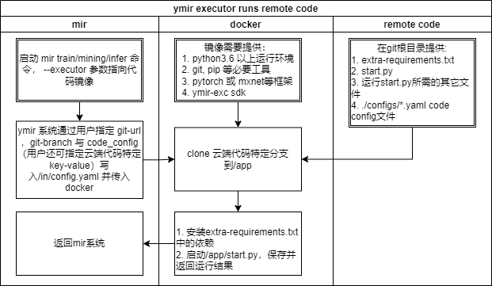

# ymir-live-code-executor demo

利用同一个live-code-executor镜像，运行多份训练/挖掘/推理的代码。

- [live-code-executor](https://github.com/IndustryEssentials/ymir-executor/tree/master/live-code-executor) 支持在线运行的ymir镜像
- [live-code](https://github.com/IndustryEssentials/ymir-remote-git) 支持ymir镜像在线运行的代码库
- [ymir-executor](https://github.com/IndustryEssentials/ymir-executor) ymir镜像库
- [ymir-executor api](https://github.com/IndustryEssentials/ymir/blob/master/docs/ymir-cmd-container.md)

## 基本命名

- `ymir-executor`: ymir镜像，可执行训练/挖掘/推理任务中的一种或多种
- `live-code-executor`： 可以根据git_url和git_branch进行代码拉取，依赖安装并运行的镜像，
- `live-code`： git_url和git_branch对应的代码，
- `code_config`与`executor_config`： `executor_config`包含ymir预定义的keys与用户通过ymir-web端定义的keys, 而`code_config`
从`ymir-remote-git`代码中获得，具体哪一个文件可由ymir-web端定义的"code_config"字段确定。

## 镜像运行说明

- ymir通过nvidia-docker启动`live-code-executor`，并挂载`/in`和`/out`目录来处理镜像的输入和输出
- `live-code-executor`将拉取代码，安装依赖，并运行`ymir-remote-git`中的`start.py`
- `live-code-executor`通过预安装ymir-exc来读取ymir配置，读取输入的图片和标注，同时ymir-exc可以将返回权重，指标等写到ymir系统

## 分支说明
- ymir-remote-git/base: 简单演示`ymir-remote-git`的接口，不具有实际训练，挖掘与推理能力
    - configs/a.yaml: "code_config"文件
    - configs/b.yaml: "code_config"文件
    - extra-requirements.txt: python 依赖文件
    - start.py: 训练/挖掘/推理的启动程序

- ymir-remote-git/ymir-remote-v7.0: 以yolov5-v7.0版本为基础，演示`ymir-remote-git`的训练，挖掘与推理功能
    - configs/default.yaml: "code_config”文件
    - utils/ymir_yolov5.py: ymir所需的一些功能函数
    - utils/dataloaders.py: 修改dataloader以支持ymir
    - train.py: 在yolov5框架上进行一些保存路径修改，ymir进度汇报等
    - mining/data_augment.py: 挖掘算法所需的数据增加功能函数
    - mining/mining_cald.py: 挖掘算法主程序
    - extra-requirements.txt: python 依赖文件
    - start.py：训练/挖掘/推理的启动程序

## FAQ
- 什么时候使用live-code-executor?

    多数用户使用提供的[ymir-executor](https://github.com/IndustryEssentials/ymir-executor)即可完成训练/挖掘/推理任务，同时也可以参考官方镜像的dockerfile制作个人的`ymir-executor`。对于极少数拥有大量处于活跃状态的仓库，且需要经常运行仓库最新代码的用户，`live-code-executor`提供了一种自动实时的方案。

- 如何制作个人的remote-code仓库?

    选择合适的live-code-executor, 以pytorch框架为例，可参考[ymir-remote-git/base](https://github.com/IndustryEssentials/ymir-remote-git/tree/base),提供`extra-requirements.txt`, `start.py` 与 `code_config` 文件。

- 如何制作个人的live-code-executor?

    参考[live-code-executor](https://github.com/IndustryEssentials/ymir-executor/tree/master/live-code-executor)，制作相应的dockerfile与镜像。
